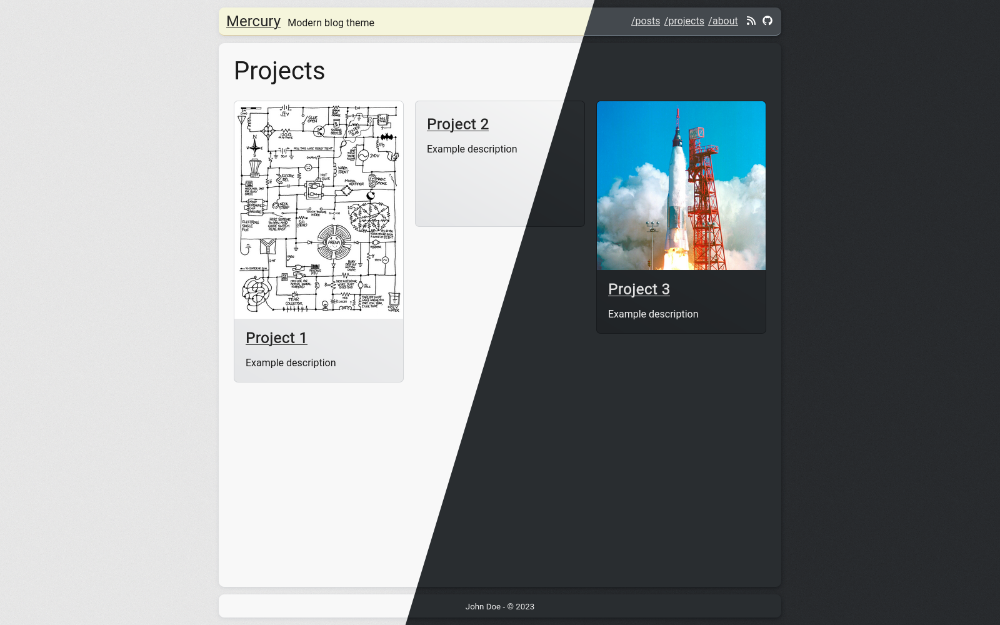

# Mercury

**Fork of the [Apollo](https://github.com/not-matthias/apollo) theme.**

Modern and minimalistic blog theme powered by [Zola](https://www.getzola.org/).  
See a live preview [here](https://mercury.flxzt.net).

<sub><sup>Named after the greek god of trickery and thieves</sup></sub>



## Installation

1. Download the theme
```
git submodule add https://github.com/flxzt/mercury themes/mercury
```

2. Add `theme = "mercury"` to your `config.toml`
3. Copy the example content

```
cp -r themes/mercury/content content
```

## Features

### Site configuration

Enable analytics with [Goatcounter](https://www.goatcounter.com/):

```toml
[extra.analytics]
enabled = true
goatcounter_user = "your_user"
goatcounter_host = "goatcounter.com"    # default= goatcounter.com

```

Use CDN for fonts:

```
[extra]
use_cdn = true
```

Add a website favicon:

```toml
[extra]
favicon = "/images/favicon.png"
```

Enable math rendering inline with `$` and blocks with `$$` through MathJax (currently always loaded through CDN):

```toml
[extra]
mathjax = true
```

Set a color scheme:

```toml
[extra]
theme = "auto"      # either `auto`, `dark` or `light`
```

Social buttons can be added. The available icon names are the file names without `.svg` in `static/social_icons/`.

```toml
[extra]
socials = [
    { name = "rss", url = "https://mercury.flxzt.net/atom.xml", icon = "rss" },
    { name = "github", url = "https://github.com/flxzt/mercury", icon = "github" },
]
```

Add stylesheets to override the theme.
These filenames are relative to the root of the site. In this example, the two CSS files would be in the `static` folder.

```toml
[extra]
stylesheets = [
    "override.css",
    "something_else.css"
]
```

Add a footer:

```toml
[extra.footer]
enabled = true
# You can either set the footer text here or overwrite the footer.html template for custom html
text = "John Doe - © 2022"
```

### Pages

To enable a table of contents, add this to the page frontmatter:

```toml
[extra]
toc = true
```

Or a tldr at the start:

```toml
[extra]
tldr = "This page is way too long!"
```

Pages can have a banner image:

```toml
[extra]
banner_image = "/absolute/path/to/image.png"
```

Specify that a page is an URL link instead of content.

```toml
[extra]
link_to = "https://project.page.com"
```

### Sections

Specify that a section is a direct child of the index and its pages should appear there:

```toml
[extra]
show_in_index = true
```

If this is set, it is possible to specify how many pages should be shown:
```toml
[extra]
index_n_pages = 7
```


### Templates

Use custom templates by adding this: `template = "<name>.html` to the page or section frontmatter.

**cards**

The `cards.html` section template to display projects with cards.

When using it pages can have a card image with:

```toml
template = "cards.html"
[extra]
card_image = "/absolute/path/to/image.png"
```

**webapps**

There is a `webapp.html` page template for embedding web apps in an iframe.

Specify the path to the webapp in the page frontmatter:

```toml
template = "webapp.html"
[extra]
webapp = "/path/to/webapp/index.html
```


### Shortcodes

There is a gallery shortcode which searches the page directory for images and displays them as a foto gallery. Usage in markdown:

```markdown
{{ gallery() }}
```

To display a right-aligned floating text, use the `aside(width="<value>")` shortcode (any valid css width value with the unit can be passed as a parameter).
The shortcode has a body, so it has to be terminated with ``. Usage:

```markdown
{% aside(width="50%") %}
Some related info

```

It can be useful to then break the flowing text manually. For this there is the `clear()` shortcode:

```markdown
{{ clear() }}
```

To help with alignment, any content can be resized to be a specific width with `withwidth(width="<value>")`:

```markdown
{% withwidth(width="50%") %}
Content is maximum 50 percent!

```

Write a caption with:

```markdown
{{ caption(text="This is the caption text") }}
```